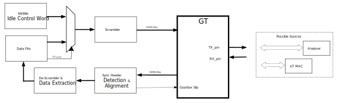

.. include:: ../../../../shared/links.rst
.. include:: ../shared/include.rst

.. _gt-lpbk-test-case-description:

##########################################################################
GT LPBK test case description
##########################################################################

.. contents:: Table of contents
   :local:
   :depth: 2

The goal of this test case is to allow verification of GT transceivers on |Alveo|_ cards at 25GbE lane rates. The 4 lanes are tested.

This CU requires a 25GbE traffic source. From the incoming traffic, the 64/66b Sync Header are acquired and if needed the GT gearbox get slip until Sync Header lock.
Any Idle word (Block Type Field = 0x1E) are ignored, any other words are stored in the FIFO (after being descrambled).

Based on the filling level of the FIFO, Data are read out or Idle word are used. These words are scrambled and then sent to the GT.

By removing and inserting Idle, the GT LPBK is doing a rate adaptation of the incoming traffic.

    GT LPBK CU block diagram

.. _gt-lpbk-test-set-up:

.. include:: ../shared/gt-test-set-up.rst

.. _gt-lpbk-gt-settings:

.. include:: ../shared/gt-settings.rst

********************************************************
Main test steps
********************************************************

A test is only composed of 1 step which defines of the hardware environment (see :ref:`gt-lpbk-test-json-members`).

1. Configuration.

========================================================
Test parameters
========================================================

The mandatory test configuration parameters are listed below.
For more information, see :ref:`gt-lpbk-test-json-members`.

* |gt-lpbk-duration|: The duration of the test, measured in seconds.
* |gt-lpbk-mode|        : Mode of the compute unit.

********************************************************
Status
********************************************************

GT LPBK CU doesn't provide any status and always passes.

.. _gt-lpbk-test-json-members:

********************************************************
GT LPBK test JSON members
********************************************************

Here is an example of GT LPBK test cases.
Some test JSON members can be overwritten for each lane using the test JSON member ``lane_config`` which child members are lane indexes.

.. note::
    Only the configuration step is required for GT as the rate adaption logic is always running. There is no real need to include a ``run`` step.

----

=====================================================
Example
=====================================================

.. code-block:: JSON

    "gt_lpbk": {
      "0": {
        "global_config": {
          "test_sequence": [
            { "duration":  1, "mode": "conf_25gbe_no_fec" }
          ]
        }
      }
    }

----

=====================================================
Definition
=====================================================

The following table shows all members available for this test case.
More details are provided for each member in the subsequent sections.

.. table:: GT LPBK test JSON members

    +---------------------------------------------------+---------------+----------------------+---------------------------------------------------------+
    | Member                                            | Lane override | Mandatory / optional | Description                                             |
    +===================================================+===============+======================+=========================================================+
    | :ref:`gt-lpbk-parameter-test_sequence`            | no            | Mandatory            | Describes the sequence of tests to perform.             |
    +---------------------------------------------------+---------------+----------------------+---------------------------------------------------------+
    | :ref:`gt-lpbk-parameter-gt_settings`              | no            | Optional             | Selects the GT default configuration.                   |
    |                                                   |               |                      | See |GT LPBK JSON Member|.                              |
    +---------------------------------------------------+---------------+----------------------+---------------------------------------------------------+
    | :ref:`gt-lpbk-parameter-gt_tx_diffctrl`           | yes           | Optional             | Select the Driver Swing Control.                        |
    |                                                   |               |                      | See |GT LPBK JSON Member|.                              |
    +---------------------------------------------------+---------------+----------------------+---------------------------------------------------------+
    | :ref:`gt-lpbk-parameter-gt_tx_pre_emph`           | yes           | Optional             | Select Transmitter pre-cursor TX pre-emphasis control.  |
    |                                                   |               |                      | See |GT LPBK JSON Member|.                              |
    +---------------------------------------------------+---------------+----------------------+---------------------------------------------------------+
    | :ref:`gt-lpbk-parameter-gt_tx_post_emph`          | yes           | Optional             | Select Transmitter post-cursor TX pre-emphasis control. |
    |                                                   |               |                      | See |GT LPBK JSON Member|.                              |
    +---------------------------------------------------+---------------+----------------------+---------------------------------------------------------+
    | :ref:`gt-lpbk-parameter-gt_tx_polarity`           | yes           | Optional             | Select TX Polarity.                                     |
    |                                                   |               |                      | See |GT LPBK JSON Member|.                              |
    +---------------------------------------------------+---------------+----------------------+---------------------------------------------------------+
    | :ref:`gt-lpbk-parameter-gt_rx_use_lpm`            | yes           | Optional             | Select RX Equalizer.                                    |
    |                                                   |               |                      | See |GT LPBK JSON Member|.                              |
    +---------------------------------------------------+---------------+----------------------+---------------------------------------------------------+

----

.. _gt-lpbk-parameter-test_sequence:

=====================================================
``test_sequence``
=====================================================

Mandatory. Describes the sequence of tests to perform.
Tests are performed serially, and a failure in one test does not stop the sequence (the next test will be launched).
There is no limitation to the length of the test sequence.

This field contains a list of tests, each test being defined by an object of key–value parameters pairs: ``[ {}, {}, {} ]``.

The following table defines the parameters supported in the GT MAC test sequence:

.. _gt-lpbk-parameter-test_sequence-duration:
.. _gt-lpbk-parameter-test_sequence-mode:

.. table:: GT MAC test sequence parameters

    +-------------------+----------------------+------------------------------------------------------------------+
    | Member            | Mandatory / optional | Description                                                      |
    +===================+======================+==================================================================+
    | ``duration``      | Mandatory            | The duration of the test in seconds; Range [1, 2\ :sup:`32`\-1]. |
    +-------------------+----------------------+------------------------------------------------------------------+
    | ``mode``          | Mandatory            | Mode of the compute unit. See the following table.               |
    +-------------------+----------------------+------------------------------------------------------------------+

.. table:: ``mode`` possible values

    +-------------------------------+------------------------------------------------------------------------------------+
    | Possible Value                | Description                                                                        |
    +===============================+====================================================================================+
    | ``conf_25gbe_no_fec``         | Apply the settings specified in the configuration parameters to the GT hardware.   |
    +-------------------------------+------------------------------------------------------------------------------------+
    | ``run``                       | As the rate adaptation is always running, this configuration is not really needed. |
    |                               | It can be used to insert a time gap (pause) in-between tests.                      |
    +-------------------------------+------------------------------------------------------------------------------------+
    | ``tx_rx_rst``                 | Initiate a reset of the GT wizard TX and RX paths.                                 |
    +-------------------------------+------------------------------------------------------------------------------------+

----

.. _gt-lpbk-parameter-gt_settings-JSON-members:

.. include:: ../shared/gt-settings-JSON-members.rst

More info can be found here: |GT LPBK Settings|.
Further details on each of settings can be found in |UG578|_.

----

.. _gt-lpbk-parameter-gt_settings:

.. include:: ../shared/gt-parameter-gt_settings.rst

----

.. _gt-lpbk-parameter-gt_tx_diffctrl:

.. include:: ../shared/gt-parameter-gt_tx_diffctrl.rst

----

.. _gt-lpbk-parameter-gt_tx_pre_emph:

.. include:: ../shared/gt-parameter-gt_tx_pre_emph.rst

----

.. _gt-lpbk-parameter-gt_tx_post_emph:

.. include:: ../shared/gt-parameter-gt_tx_post_emph.rst

----

.. _gt-lpbk-parameter-gt_tx_polarity:

.. include:: ../shared/gt-parameter-gt_tx_polarity.rst

----

.. _gt-lpbk-parameter-gt_rx_use_lpm:

.. include:: ../shared/gt-parameter-gt_rx_use_lpm.rst

----

********************************************************
Output file
********************************************************

No result file is created by the GT LPBK test case. This test case always passes.
