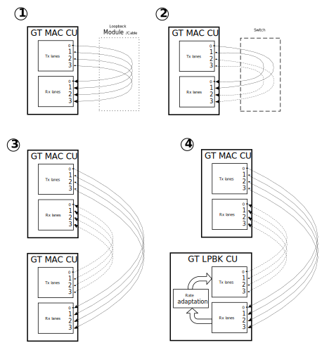

.. include:: ../../../../shared/links.rst
.. include:: ../shared/include.rst

##########################################################################
GT test cases description
##########################################################################

.. toctree::
   :maxdepth: 3
   :hidden:

   GT MAC <./gt-mac-test-case-description.rst>
   GT PRBS <./gt-prbs-test-case-description.rst>
   GT LPBK <./gt-lpbk-test-case-description.rst>

GTs are tested by sending and receiving traffic at 10GbE and 25GbE rate. The simplest test consists of looping back each individual lane to themselves (Tx to Rx).
Although all CU are designed to test the 4 lanes simultaneously, each lane can be configured (or disabled) individually.

There are 3 types of CU to test the GT, each offering different test capabilities:

  * **GT MAC CU**: generates & checks ethernet packet at 10GbE and 25GbE rate in |GT MAC| test case.

      * This CU allows, per lane, complex GbE traffic configuration (packet size & rate ...) via the support of 10G/25G High Speed Ethernet Subsystem IP core (see |PG210|_).
      * This CU can be connected to itself, to another instance of itself or to a switch (to support cross lane traffic).

  * **GT PRBS CU**: generates & checks 64/66b PRBS-31 data at 25GbE rate in |GT PRBS| test case.

      * This CU requires to be looped back to itself.

  * **GT LPBK CU**: loops back incoming 25GbE traffic by performing a rate adaptation in |GT LPBK| test case.

    .. warning::
      GT LPBK CU requires a traffic source. It should be only used together with GT MAC CU.

The |xclbin| content dictates which test can be performed and how the GT should/could (or not) be interconnected.
The choice of the CU is done during the xclbin generation. It's mainly based on how many CU can be inserted.
Ideally GT MAC CU should be used but its huge resource utilization could make it impossible to insert multiple times within the FPGA.

Here are some examples of how to interconnect the GT when the xclbin contains more than one GT CU.

  * GT PRBS CU can only be looped back to itself via module or cable.
  * GT LPBK CU can only be connected to a GT MAC CU.
  * GT MAC CU can be:

      1. Looped back to itself via module or cable: each individual lane is expecting to receive (Rx) what it has transmitted (Tx).
      2. Looped back to itself via a switch: cross lane traffic.
         Lanes must be paired: one lane sends & receives traffic only to & from another one.
      3. Connected to another GT MAC CU present in the same xclbin: this interconnects individual lanes from both CUs.
         E.g. Lane[i] of one GT MAC CU receives and sends traffic to Lane[i] of the other GT MAC CU.
      4. Connected to GT LPBK CU: in this case, only 25GbE traffic is supported.

    GT MAC CU interconnections
