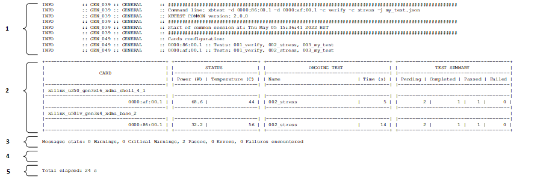
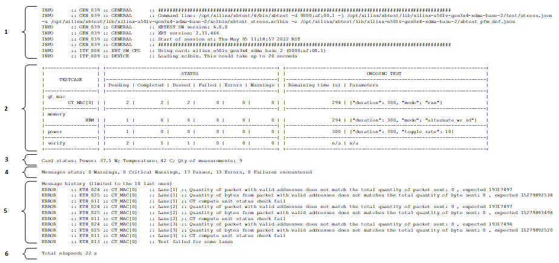

.. include:: ../../../../shared/links.rst
.. include:: ../shared/include.rst

.. _display-modes:

##########################################################################
Display modes
##########################################################################

An execution of xbtest will typically contain the following messages:

  * **Start banner**: Information about the run: start time and versions (for example, xbtest and XRT).
  * **Messages from test cases**:

      * Start.
      * Status and results.
      * End.

  * **End banner**:

      * Information about the run: end time and versions.
      * Summary of all tests run and their results.
      * Global result of xbtest run.

xbtest supports two display modes, which are described in the following sections:

  * **dynamic**: Default mode.
  * **static**: As per previous version of xbtest.

The information displayed differs between the use cases:

  * **Multi tests**: Card (power and temperature) and test status for all targeted cards.
  * **Single test**: Card (power and temperature) and |test cases| (power, memory, GT MAC) status for targeted card.

By default, the console dynamically displays xbtest messages.
Regularly, the entire console is cleared, and its content is refreshed.
At the end of xbtest execution, the console returns to the initial state, and the last content displayed in the dynamic mode is repeated.

********************************************************
Multi tests display
********************************************************

In this use case, the content displayed in the console contains the following:

  * **Messages displayed before the first test case starts**:

      * Start banner.
      * Card selection.

  * **Test information**: A table presenting the following:

      * **Card status**: Basic sensor information (power consumption and temperature of the card).
      * **Ongoing test information**: Duration and current test running.
      * **Test summary**: Results of previous tests.

  * **Message statistics**: Quantity of messages available for each severity, which are in ``common.log``.
  * **Message history**: 10 last important messages (warning, error, and failure).

    Example of information available in dynamic display mode for multi tests

Legend:

  1. Messages displayed before first test case starts.
  2. Card status, test status and information about ongoing tests.
  3. Messages statistics.
  4. Messages history.
  5. Elapsed time.

********************************************************
Single test display
********************************************************

In this use case, the content displayed in the console contains the following:

  * **Messages displayed before the first test case starts**:

      * Start banner.
      * Card selection.

  * **Test cases information**: A table presenting the following:

      * **Test cases and messages status**: Results of previous tests, quantity of warning, pass, error, and failure messages.
      * **Ongoing test information**: Duration and current test running.

  * **Card status**: Basic sensor information (power consumption and temperature of the card).
  * **Message statistics**: Quantity of messages available for each severity, which are in ``xbtest.log``.
  * **Message history**: 10 last important messages (warning, error, and failure).

    Example of information available in dynamic display mode for single test

Legend:

  1. Messages displayed before first test case starts.
  2. Test cases status and information about ongoing tests.
  3. Card status.
  4. Messages statistics.
  5. Messages history.
  6. Elapsed time.

********************************************************
Disable dynamic display
********************************************************

When using command line option :option:`-F`, all messages are displayed consecutively, and the console is never cleared.

The information displayed in this mode is the same as the information available in:

  * ``common_summary.log`` when running multiple tests.
  * ``summary.log`` when running a single test.
